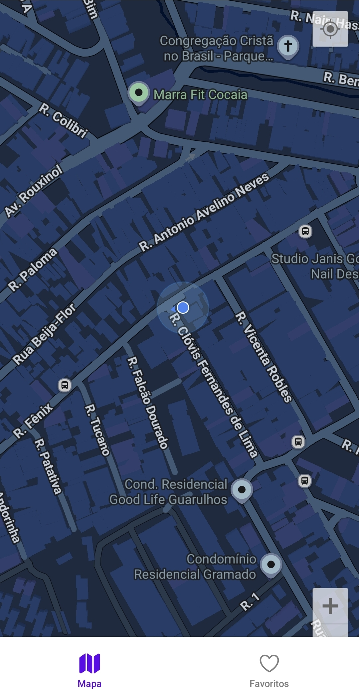
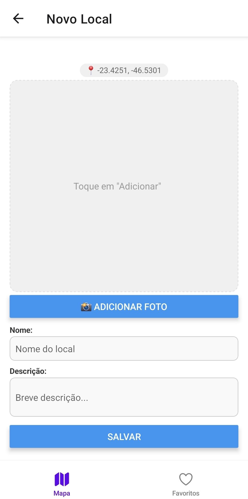
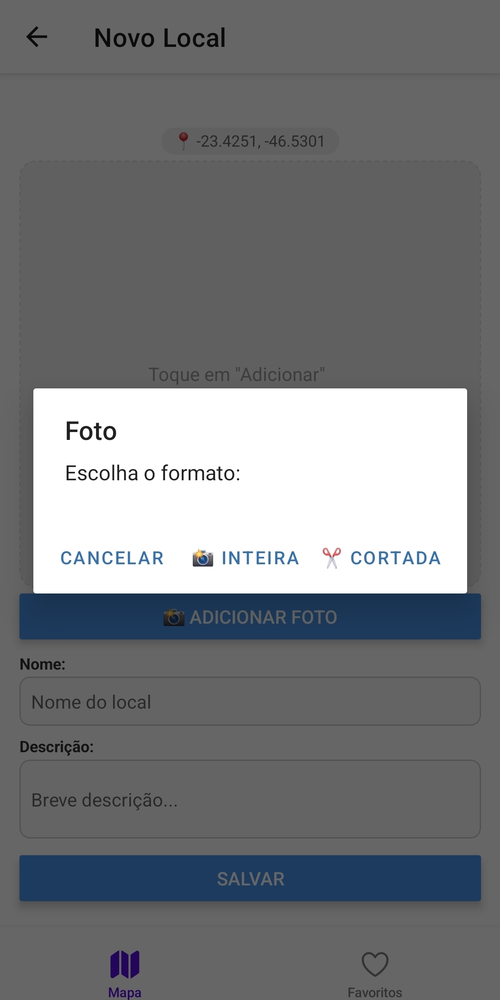
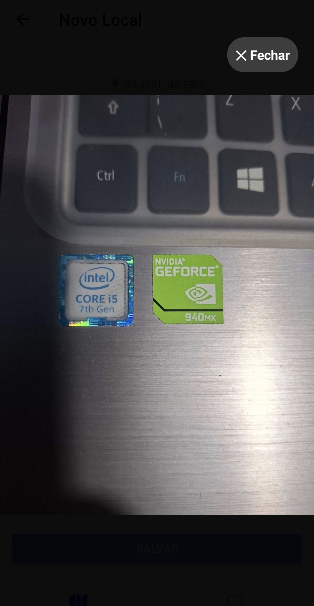

# 📍 MyPlaces - Gerenciador de Locais Favoritos


Este projeto é uma aplicação mobile desenvolvida em **React Native** com **TypeScript**, focada no gerenciamento de geolocalização e captura de mídia. O app permite ao usuário visualizar sua posição atual, salvar locais favoritos e anexar fotos tiradas na hora, com opções avançadas de UX.

---

## 📱 Funcionalidades

- **🗺️ Mapa Interativo:** Visualização da localização atual do usuário em tempo real.
- **📍 Gestão de Favoritos:** CRUD completo (Criar, Ler, Atualizar, Deletar) de locais.
- **📸 Câmera Inteligente:** Integração com a câmera do dispositivo oferecendo dois modos:
  - **Foto Inteira:** Captura ampla sem cortes (com ajuste automático de `resizeMode`).
  - **Foto Recortada:** Captura com ferramenta de edição/corte (crop) 16:9.
- **🔍 Zoom de Imagem:** Modal interativo para visualização de fotos em tela cheia.
- **💾 Persistência de Dados:** Armazenamento local utilizando `AsyncStorage`.
- **🎨 UI/UX Responsivo:** Layout adaptativo ("Fit to Screen") com `KeyboardAvoidingView` e `SafeAreaContext` para suporte a Notches e teclados virtuais.

---

## 🛠️ Tecnologias Utilizadas

O projeto foi desenvolvido utilizando as seguintes bibliotecas:

- **Core:** [React Native](https://reactnative.dev/) + [Expo](https://expo.dev/)
- **Linguagem:** [TypeScript](https://www.typescriptlang.org/)
- **Navegação:** [React Navigation](https://reactnavigation.org/) (Bottom Tabs)
- **Mapas:** [React Native Maps](https://github.com/react-native-maps/react-native-maps)
- **Mídia:** [Expo Image Picker](https://docs.expo.dev/versions/latest/sdk/imagepicker/)
- **Armazenamento:** [Async Storage](https://react-native-async-storage.github.io/async-storage/)
- **Ícones:** [Ionicons](https://icons.expo.fyi/)
- **Layout:** [React Native Safe Area Context](https://github.com/th3rdwave/react-native-safe-area-context)

---

## 📸 Screenshots

<div align="center">
  <table>
    <tr>
      <td align="center">
        
        <br />
        <sub><b>Mapa & Lista</b></sub>
      </td>
      <td align="center">
        
        <br />
        <sub><b>Cadastro de Local</b></sub>
      </td>
      <td align="center">
        
        <br />
        <sub><b>Opções de Câmera</b></sub>
      </td>
      <td align="center">
        
        <br />
        <sub><b>Zoom na Foto</b></sub>
      </td>
    </tr>
  </table>
</div>

---

## 🚀 Como executar o projeto

### Pré-requisitos
Antes de começar, você precisa ter instalado em sua máquina:
- [Node.js](https://nodejs.org/en/) (versão LTS recomendada)
- [Git](https://git-scm.com/)
- Aplicativo **Expo Go** no seu celular (Android ou iOS) ou um emulador configurado.

### Passo a passo

1. **Clone o repositório**
   ```bash
   git clone https://github.com/renatoribeirodev/places_expo_full10.git

2. **Acesse a pasta do projeto**
   cd NOME-DO-REPO

3. **Instale as dependências**
   npm install
   npx expo install @expo/vector-icons

4. **Inicie o servidor de desenvolvimento**
   npm start

5. **Rode no seu dispositivo**
   * Leia o QR Code exibido no terminal com o app Expo Go.
  Ou pressione a para abrir no Emulador Android / i para Simulador iOS.